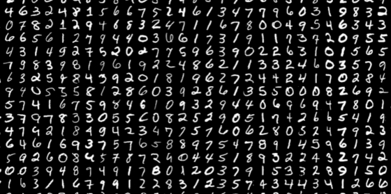
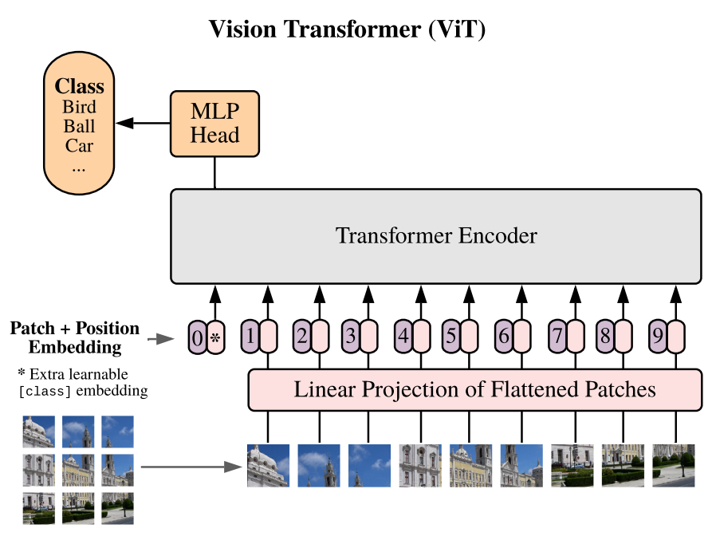
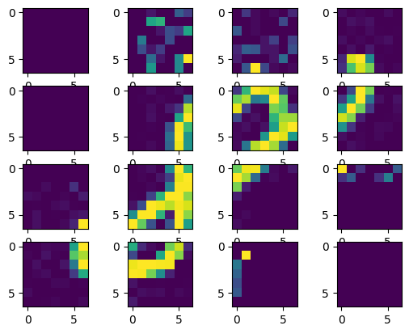
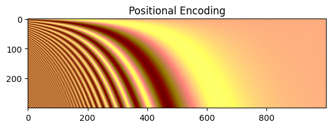
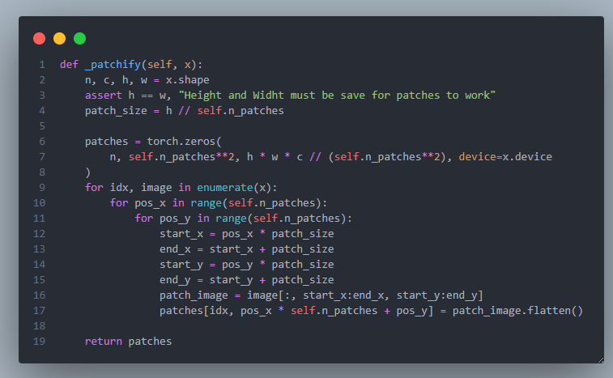
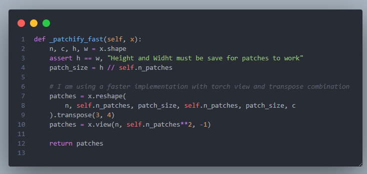

# Vision Transformer From Scratch (+ Digit Recognizer Kaggle Competition)

<!-- 
 -->

<table>
  <tr>
    <td align="center">
       
      <em>Digit Recognizer Kaggle Competition</em>
    </td>
    <td align="center">
       
      <em>Vision Transformer</em>
    </td>
  </tr>
    <td align="center">
       
      <em>Patches of Image</em>
    </td>
    <td align="center">
       
      <em>No Image</em>
    </td>
  <tr>
  </tr>
  
</table>

## 🚀 About This Project

This project is the creation of Vision Transformer ViT from scratch. The ViT tops the leaderboards on Kaggle Competitions and has given a critical boost step in computer vision applications so i must make a deep dive in the architecture. I am following the paper [AN IMAGE IS WORTH 16X16 WORDS: TRANSFORMERS FOR IMAGE RECOGNITION AT SCALE](https://arxiv.org/pdf/2010.11929) that showcased the implementation and i will train on [Kaggle Digit Recognizer](https://www.kaggle.com/competitions/digit-recognizer) competition that i have also tried in the past ([old repo](https://github.com/VasilisMpletsos/Digit_Recognizer_Kaggle_Competition)) and i had achieved **99.56%** with a custom network made in Tensorflow. Now the new network will be a ViT from scratch made in Pytorch that is my preference framework for years now and lets see what we can achieve.

We may though meet a performance wall and not do better than custom small networks as the authors clearly say that:

##

<i>"When trained on mid-sized datasets such as ImageNet without strong regularization, these models yield modest accuracies of a few percentage points below ResNets of comparable size. This seemingly discouraging outcome may be expected: Transformers lack some of the inductive biases inherent to CNNs, such as translation equivariance and locality, and therefore do not generalize well when trained on insufficient amounts of data."</i>

##

`Our solution is to explore the size of the neural network by making it configurable.`

Here is an image of positional encoding (with sin/cos) that still facinates me.

## Speedups

A very intresting and a classical pain point is the handling of images / tensors in pytorch. You can do it in the naive programming way or you can utilize
pytorch built in crazy ways. One of the most classical ones is the rearrange, view and transpose that can give awesome amout of speedups. In our case i used first the naive way and then the pytorch way for the \_patchify function and the results speak for themselves **x48_407 boost**

- Torch way: 6.28 μs ± 95.2 ns
- Custom way: 304 ms ± 6.6 ms
<table>
  <tr>
    <td align="center">
       
      <em>Slows Patchify</em>
    </td>
    <td align="center">
       
      <em>Fast Patchify</em>
    </td>
  </tr>
  <tr>
  </tr>
